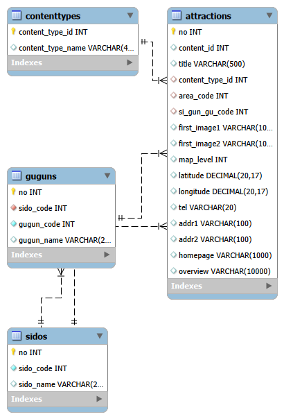

# 어디갈래? (Where Should We Go, WSWG)

> 여행 계획을 자동으로 생성하고, 함께 수정할 수 있는 협업형 여행 플래너 서비스

## 1. 프로젝트 소개

**어디갈래?**는 여행을 준비하는 과정에서 발생하는 번거로움을 줄이기 위한 서비스입니다.

사용자는 여행 지역을 선택하고, 해당 지역의 관광지 데이터를 기반으로 여행 계획을 생성할 수 있습니다.  
또한 함께 여행하는 사람들과 하나의 여행 계획을 공유하고 수정할 수 있습니다.

영문 서비스명은 **Where Should We Go**이며, 약어로 **WSWG**를 사용합니다.

---

## 2. 핵심 기능

### 여행 계획 자동 생성

사용자가 선택한 지역과 관광지 데이터를 기반으로 여행 일정을 생성합니다.

예시 입력 조건:

- 여행 지역
- 여행 기간
- 여행 인원
- 여행 스타일
- 선호 관광지
- 이동 방식

생성 결과 예시:

- 날짜별 여행 일정
- 시간대별 방문 장소
- 관광지 정보
- 간단한 장소 설명
- 여행 메모

---

### 공동 수정 기능

여러 사용자가 하나의 여행 계획을 함께 수정할 수 있습니다.

MVP에서는 Google Docs 수준의 완전한 실시간 문서 편집 기능보다는,  
여행 일정 단위의 공동 수정 기능을 우선 구현합니다.

예시 기능:

- 여행 계획 공유
- 일정 항목 추가
- 일정 항목 수정
- 일정 항목 삭제
- 참여자별 수정 반영
- 실시간 또는 준실시간 동기화

---

## 3. MVP 목표

WSWG의 MVP 목표는 다음과 같습니다.

> 사용자가 여행 지역을 선택하면 관광지 데이터를 기반으로 기본 여행 계획이 생성되고,  
> 초대된 사용자가 같은 여행 계획을 함께 수정할 수 있다.

MVP에서는 모든 기능을 완벽하게 구현하기보다,  
서비스의 핵심 가치인 **자동 여행 계획 생성**과 **공동 편집 경험**을 검증하는 데 집중합니다.

---

## 4. MVP 기능 범위

### 사용자 기능

- 회원가입
- 로그인
- 로그아웃
- 내 여행 계획 목록 조회

---

### 여행 계획 기능

- 여행 계획 생성
- 여행 계획 상세 조회
- 여행 계획 수정
- 여행 계획 삭제
- 여행 계획 공유

---

### 관광지 기능

- 전체 시/도 목록 조회
- 특정 시/도에 속한 구/군 목록 조회
- 관광지 목록 조회
- 관광지 상세 조회
- 지역 기반 관광지 조회
- 키워드 기반 관광지 검색
- 관광지 등록
- 관광지 수정
- 관광지 삭제

---

### 자동 생성 기능

- 여행 지역 선택
- 관광지 데이터 조회
- 관광지 기반 일정 생성
- 생성된 일정 저장
- 생성된 일정 수정 가능

---

### 공동 편집 기능

- 공유된 여행 계획 접근
- 참여자 목록 확인
- 일정 항목 추가
- 일정 항목 수정
- 일정 항목 삭제
- 변경 내용 반영

---

## 5. MVP에서 제외하는 기능

초기 MVP에서는 아래 기능을 제외합니다.

- 항공권 예약
- 숙소 예약
- 결제 기능
- 지도 기반 최적 경로 계산
- 완전한 실시간 문서 편집
- 채팅 기능
- 복잡한 권한 관리
- 여행 비용 정산
- 알림 기능
- 모바일 앱

---

## 6. 주요 화면

### 로그인 / 회원가입 화면

사용자는 계정을 생성하거나 로그인할 수 있습니다.

---

### 여행 계획 목록 화면

사용자가 생성했거나 공유받은 여행 계획 목록을 확인할 수 있습니다.

---

### 여행 계획 생성 화면

사용자는 여행 계획 생성을 위한 기본 조건을 입력합니다.

입력 예시:

- 여행지
- 출발일
- 종료일
- 여행 인원
- 여행 스타일
- 선호 관광지 카테고리

---

### 관광지 조회 화면

사용자는 시/도와 구/군을 선택해 해당 지역의 관광지를 조회할 수 있습니다.

기능 예시:

- 시/도 선택
- 구/군 선택
- 관광지 목록 확인
- 관광지 상세 정보 확인
- 키워드 검색

---

### 여행 계획 상세 화면

자동 생성된 여행 일정을 확인하고 수정할 수 있습니다.

기능 예시:

- 날짜별 일정 확인
- 일정 항목 추가
- 일정 항목 수정
- 일정 항목 삭제

---

### 공유 / 공동 편집 화면

공유받은 사용자가 같은 여행 계획에 접근해 일정을 수정할 수 있습니다.

---

## 7. 관광지 데이터 구조

WSWG의 MVP에서는 여행 계획 자동 생성을 위해 관광지 데이터를 중심으로 구성합니다.

기본 관광지 데이터는 지역 정보인 `Sido`, `Gugun`과 실제 관광지 정보인 `Attraction`으로 구성됩니다.

---

### Sido

시/도 정보를 저장하는 데이터입니다.

| 필드 | 설명 |
|---|---|
| sidoCode | 시/도 코드 |
| sidoName | 시/도 이름 |

---

### Gugun

구/군 정보를 저장하는 데이터입니다.

| 필드 | 설명 |
|---|---|
| gugunCode | 구/군 코드 |
| sidoCode | 시/도 코드 |
| gugunName | 구/군 이름 |

`Gugun`은 `Sido`에 속합니다.

---

### Attraction

관광지 정보를 저장하는 데이터입니다.

| 필드 | 설명 |
|---|---|
| no | 관광지 고유 번호 |
| contentId | 관광지 콘텐츠 ID |
| title | 관광지 이름 |
| contentTypeId | 관광지 타입 ID |
| sidoCode | 시/도 코드 |
| gugunCode | 구/군 코드 |
| firstImage1 | 대표 이미지 URL |
| firstImage2 | 썸네일 이미지 URL |
| mapLevel | 지도 확대 레벨 |
| latitude | 위도 |
| longitude | 경도 |
| tel | 전화번호 |
| addr1 | 기본 주소 |
| addr2 | 상세 주소 |
| homepage | 홈페이지 |
| overview | 관광지 설명 |

---

## 8. 관광지 데이터 관계

WSWG의 관광지 데이터는 다음과 같은 관계를 가집니다.

- 하나의 `Sido`는 여러 개의 `Gugun`을 가질 수 있습니다.
- 하나의 `Sido`는 여러 개의 `Attraction`을 가질 수 있습니다.
- 하나의 `Gugun`은 여러 개의 `Attraction`을 가질 수 있습니다.
- 하나의 `Attraction`은 특정 `Sido`, `Gugun`에 속합니다.

관계 구조는 다음과 같습니다.

- `Sido 1 : N Gugun`
- `Sido 1 : N Attraction`
- `Gugun 1 : N Attraction`

---

## 9. 관광지 기능

MVP에서는 관광지 데이터를 기반으로 여행 계획 자동 생성 기능을 구현합니다.

### 지역 조회

- 전체 시/도 목록 조회
- 특정 시/도에 속한 구/군 목록 조회

### 관광지 조회

- 전체 관광지 목록 조회
- 관광지 상세 조회
- 시/도 기준 관광지 조회
- 구/군 기준 관광지 조회
- 키워드 기반 관광지 검색

### 관광지 관리

- 관광지 등록
- 관광지 단건 조회
- 관광지 목록 조회
- 관광지 수정
- 관광지 삭제

---

## 10. API 설계 초안

### Sido API

| Method | URL | 설명 |
|---|---|---|
| GET | `/api/sidos` | 전체 시/도 목록 조회 |

---

### Gugun API

| Method | URL | 설명 |
|---|---|---|
| GET | `/api/sidos/{sidoCode}/guguns` | 특정 시/도에 속한 구/군 목록 조회 |

---

### Attraction API

| Method | URL | 설명 |
|---|---|---|
| GET | `/api/attractions` | 관광지 목록 조회 |
| GET | `/api/attractions/{no}` | 관광지 상세 조회 |
| POST | `/api/attractions` | 관광지 등록 |
| PUT | `/api/attractions/{no}` | 관광지 수정 |
| DELETE | `/api/attractions/{no}` | 관광지 삭제 |

---

### Attraction Search API

| Method | URL | 설명 |
|---|---|---|
| GET | `/api/attractions?sidoCode={sidoCode}` | 시/도 기준 관광지 조회 |
| GET | `/api/attractions?sidoCode={sidoCode}&gugunCode={gugunCode}` | 시/도, 구/군 기준 관광지 조회 |
| GET | `/api/attractions?keyword={keyword}` | 키워드 기반 관광지 검색 |

---

## 11. Java 패키지 구조

관광지 관련 DTO, DAO, Service는 `com.ssafy.wswg.model` 하위에 위치합니다.

| 패키지 | 설명 |
|---|---|
| `com.ssafy.wswg.model.dto` | 관광지 관련 DTO |
| `com.ssafy.wswg.model.dao` | 관광지 관련 DAO |
| `com.ssafy.wswg.model.service` | 관광지 관련 Service |

DTO 구조는 다음과 같습니다.

| 파일 | 설명 |
|---|---|
| `SidoDto.java` | 시/도 정보 DTO |
| `GugunDto.java` | 구/군 정보 DTO |
| `AttractionDto.java` | 관광지 정보 DTO |

---

## 12. 주요 메서드 설계

### AttractionDao

| 메서드 | 설명 |
|---|---|
| `selectSidos()` | 전체 시/도 목록 조회 |
| `selectGuguns(int sidoCode)` | 특정 시/도에 속한 구/군 목록 조회 |
| `insertAttraction(AttractionDto attractionDto)` | 관광지 등록 |
| `selectAttraction(int no)` | 관광지 단건 조회 |
| `selectAttractions()` | 관광지 목록 조회 |
| `updateAttraction(AttractionDto attractionDto)` | 관광지 수정 |
| `deleteAttraction(int no)` | 관광지 삭제 |

---

### AttractionService

| 메서드 | 설명 |
|---|---|
| `getSidos()` | 전체 시/도 목록 조회 |
| `getGuguns(int sidoCode)` | 특정 시/도에 속한 구/군 목록 조회 |
| `createAttraction(AttractionDto attractionDto)` | 관광지 생성 |
| `getAttraction(int no)` | 관광지 단건 조회 |
| `getAttractions()` | 관광지 목록 조회 |
| `updateAttraction(AttractionDto attractionDto)` | 관광지 수정 |
| `deleteAttraction(int no)` | 관광지 삭제 |

---

## 13. MVP에서의 활용 방식

WSWG의 MVP는 관광지 데이터를 활용해 여행 계획 자동 생성 기능을 제공합니다.

사용자는 먼저 여행 지역을 선택합니다.

1. 사용자가 여행할 시/도를 선택한다.
2. 선택한 시/도에 속한 구/군 목록을 조회한다.
3. 사용자가 구/군을 선택한다.
4. 해당 지역의 관광지 목록을 조회한다.
5. 관광지 데이터를 기반으로 여행 계획을 생성한다.
6. 생성된 여행 계획을 사용자가 수정할 수 있다.

전체 흐름은 다음과 같습니다.

`시/도 선택 → 구/군 선택 → 관광지 조회 → 여행 일정 생성 → 일정 수정`

---

## 14. MVP 성공 기준

MVP는 아래 조건을 만족하면 성공으로 판단합니다.

- 사용자가 여행 지역을 선택할 수 있다.
- 선택한 시/도에 속한 구/군 목록을 조회할 수 있다.
- 선택한 지역의 관광지 목록을 조회할 수 있다.
- 관광지 상세 정보를 확인할 수 있다.
- 관광지 데이터를 기반으로 여행 계획을 생성할 수 있다.
- 생성된 여행 계획을 사용자가 수정할 수 있다.
- 다른 사용자를 여행 계획에 초대할 수 있다.
- 초대된 사용자가 같은 여행 계획을 수정할 수 있다.

---

## 15. 향후 확장 기능

MVP 이후에는 다음 기능을 고려합니다.

- 지도 기반 여행 동선 시각화
- 장소 추천 고도화
- AI 기반 일정 재생성
- 여행 스타일 기반 추천
- 실시간 커서 / 편집 상태 표시
- 댓글 기능
- 여행 경비 정산
- 알림 기능
- 모바일 앱
- 숙소 / 교통 예약 연동
- 여행 기록 아카이브

---

## 16. 프로젝트 핵심 가치

WSWG는 단순히 여행 일정을 작성하는 도구가 아닙니다.

여행 계획을 세우는 과정에서 발생하는 고민을 줄이고,  
함께 여행하는 사람들이 더 쉽게 의견을 반영할 수 있도록 돕는 서비스입니다.

핵심 가치는 다음과 같습니다.

- 여행 계획 작성 시간 단축
- 공동 의사결정 과정 단순화
- 함께 수정 가능한 협업 경험 제공
- 사용자의 여행 준비 부담 감소

---

## 17. 프로젝트 이름

| 구분 | 이름 |
|---|---|
| 한글명 | 어디갈래? |
| 영문명 | Where Should We Go |
| 약어 | WSWG |

