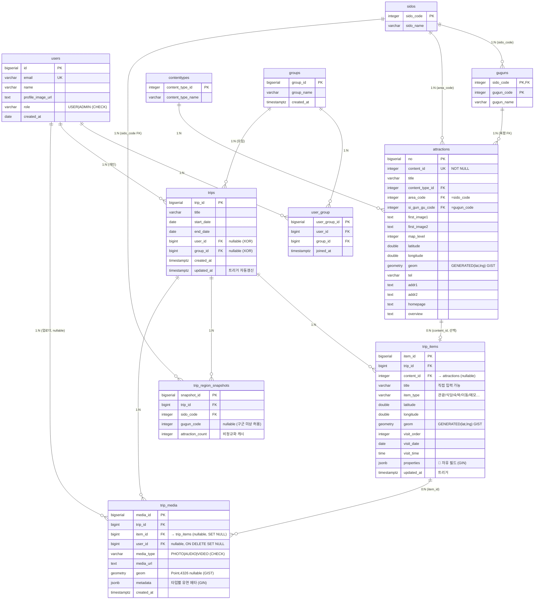

# ERD — 어디갈래?(WSWG)

**기준**: `backend/src/main/resources/db/postgres/schema.sql` (실제 PostgreSQL 스키마, 11개 테이블 전부 반영)
**DB**: PostgreSQL + PostGIS
**작성일**: 2026-06-10 (검토 2차 반영 최종본)
**적용 가이드**: `backend/src/main/resources/db/postgres/README.md`

---

## 1. 통합 ERD

> 참고: `trip_region_snapshots`는 `gugun_code`도 보관하지만 **FK는 sido_code만**(구군 미상 허용을 위해 guguns FK 제거). `(trip_id, sido_code, COALESCE(gugun_code,-1))` 유니크 인덱스로 중복 방지.

---

## 2. 테이블 현황 (전부 `schema.sql` 반영 완료)

| 테이블 | 핵심 |
|--------|------|
| users | role `CHECK (USER/ADMIN)` |
| sidos | sido_code PK |
| guguns | **복합 PK** (sido_code, gugun_code) |
| contenttypes | 테마 = 콘텐츠 타입 |
| attractions | **content_id NOT NULL UNIQUE**, **geom GENERATED(lat/lng)+GIST**, 복합 FK→guguns |
| groups | 모임 (권한 평면 — role 없음) |
| user_group | UNIQUE(user_id, group_id) |
| trips | **XOR CHECK** + 날짜 CHECK + **updated_at 트리거** |
| trip_items | **유연 항목**(노션식): content_id nullable + title/item_type/자체좌표 + **properties JSONB(GIN)**, CHECK(content_id 또는 title) |
| trip_region_snapshots | surrogate PK + gugun nullable + COALESCE 유니크 (비정규화 캐시) |
| trip_media | **item_id→trip_items**, metadata JSONB(GIN) + geom(GIST), user_id SET NULL |

---

## 3. 확정 규칙

1. **지역 컬럼명** = `area_code`/`si_gun_gu_code` (attractions, TourAPI 원문). = `sido_code`/`gugun_code`와 동일 개념(주석 명시).
2. **guguns 복합 PK** → attractions 복합 FK. 단 snapshots는 sido만 FK(구군 미상 허용).
3. **자식 FK 타깃 = `attractions.content_id`** (`NOT NULL UNIQUE`).
4. **좌표 = 3NF**: lat/lng가 단일 출처, `geom`은 **GENERATED**(자동 파생) → 동기화 불필요. trip_media.geom은 촬영 좌표(직접 입력).
5. **JSONB는 2곳**: `trip_media.metadata`(미디어 메타), `trip_items.properties`(노션식 자유 필드). 둘 다 GIN 인덱스. 나머지 정형.
9. **`trip_items`는 유연 데이터 단위**: 관광지 링크(content_id)는 **선택**, 자유 필드는 `properties`. 같은 데이터를 일정/지도/갤러리 등 **여러 뷰**로 렌더. 미디어가 붙으면 자연스럽게 "계획 → 기록"으로 전환.
6. **모임 권한 = 평면**(멤버 동일 권한, role/owner 컬럼 없음).
7. **삭제 정책**: 개인여행=유저 cascade / 모임여행 미디어=업로더 SET NULL(보존).
8. 타입: PK=BIGSERIAL, 시각=TIMESTAMPTZ(단 users.created_at=DATE 현행), 이미지/URL=TEXT.

---

## 4. 핵심 제약 요약

- `trips`: `CHECK ((user_id IS NULL) <> (group_id IS NULL))` + `CHECK (end_date >= start_date)`
- `attractions`: `content_id NOT NULL UNIQUE`, `geom GENERATED ALWAYS AS (...) STORED`
- `trip_region_snapshots`: surrogate PK, `gugun_code` nullable, `UNIQUE(trip_id, sido_code, COALESCE(gugun_code,-1))`
- `user_group`: `UNIQUE(user_id, group_id)`
- `trip_media`: `metadata JSONB DEFAULT '{}'`, `media_type CHECK`, GIN(metadata), GIST(geom), `user_id ON DELETE SET NULL`
- `users.role`: `CHECK (role IN ('USER','ADMIN'))`
- 트리거: `trg_trips_updated_at` (UPDATE 시 updated_at 자동)

---

## 5. 비정규화/운영 메모

- `trip_region_snapshots.attraction_count`는 **의도적 비정규화**(읽기 최적화 캐시). `trip_attractions` 변경 시 **앱 서비스 로직**에서 갱신.
- 지도 **권역 경계 폴리곤은 DB가 아닌 프론트 GeoJSON**으로 처리 (스키마엔 카운트만).

---

## 6. 적용 상태

- ✅ 11개 테이블 + 트리거 모두 `schema.sql` 반영.
- ⚠️ **DB 적용은 수동 (fresh 재생성)** — `CREATE TABLE IF NOT EXISTS`라 기존 테이블엔 변경 미반영.
  → `reset.sql` 실행 후 `schema.sql` 실행. 상세: `db/postgres/README.md`.
- 향후 **Flyway 도입** 권장 (자동·버전관리 적용).
