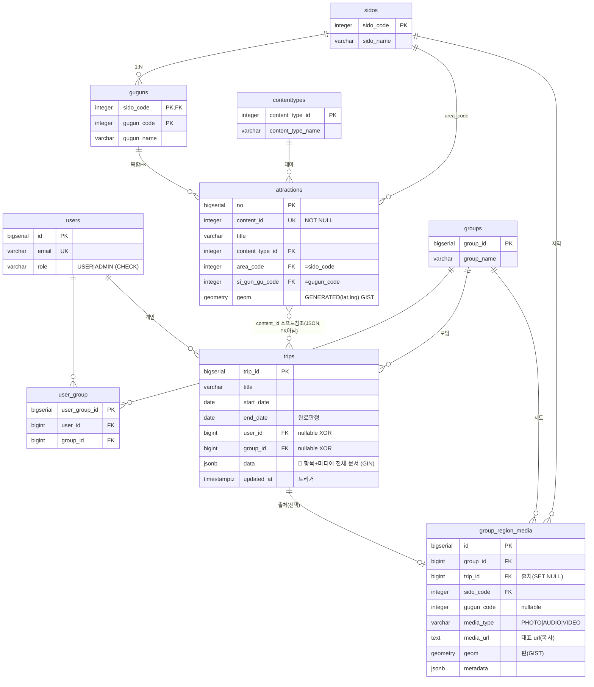

# ERD — 어디갈래?(WSWG)

**기준**: `schema.sql` (PostgreSQL + PostGIS)
**작성일**: 2026-06-10 (문서-중심 모델 확정)
**테이블 9개**: 관광 마스터 5 + 모임 2 + 여행/지도 2

> 설계 철학: **자기 여행 안에서 끝나는 데이터(항목·미디어)는 `trips.data` JSONB 문서**,
> **다른 엔티티와 관계·제약이 있는 것(그룹 지도 대표 미디어)은 관계형 테이블**.

---

## 1. 통합 ERD



---

## 2. 테이블 역할

### 🌐 관광 마스터 (TourAPI 적재)
| 테이블 | 역할 |
|--------|------|
| `sidos` / `guguns` | 지역 코드표 (guguns 복합 PK) |
| `contenttypes` | 테마 = 콘텐츠 타입 |
| `attractions` | **명소·카페·식당 위치 정보**. content_id NOT NULL UNIQUE, geom GENERATED. trips.data가 content_id로 소프트 참조 |

### 👤 회원·모임
| 테이블 | 역할 |
|--------|------|
| `users` | 회원 (role CHECK) |
| `groups` | 모임 = 지도 1개의 주인 |
| `user_group` | 멤버 매핑 (UNIQUE) |

### 🧳 여행 & 지도
| 테이블 | 역할 |
|--------|------|
| `trips` | **여행(계획↔기록)**. 날짜·소유자는 컬럼, **항목·미디어 전체는 `data` JSONB 문서**. end_date로 계획→기록 전환 |
| `group_region_media` | **그룹 지도: 지역당 대표 추억 1개**. trips.data 미디어 중 골라 복사. UNIQUE(group, 지역) |

---

## 3. `trips.data` JSONB 구조 (문서, 강제 아님)

```jsonc
{
  "items": [
    {
      "content_id": 126508,        // TourAPI 관광지면 소프트 참조, 자유항목이면 null
      "title": "경복궁",
      "type": "관광",              // 관광/식당/숙박/이동/메모…
      "lat": 37.5796, "lng": 126.9770,
      "visitDate": "2026-07-01", "order": 1, "time": "10:00",
      "media": [                   // 그 항목의 미디어 전부
        { "type": "PHOTO", "url": "...", "metadata": { "w":4032, "h":3024 } }
      ],
      "properties": { "budget": 0, "rating": 5, "memo": "일출" }   // 노션식 자유 필드
    }
  ]
}
```
- **핵심값(날짜·소유자)은 trips 컬럼**, **항목들은 data** = 하이브리드
- 동시 편집 대상 = `data` (Redis live 문서 ↔ Batch Worker가 통째 flush, 1:1)
- `idx_trips_data_gin`(GIN)으로 "content_id X 포함 여행" 등 일부 검색 가능

---

## 4. 확정 규칙

1. **항목/미디어 = `trips.data` JSONB** (자기 여행 안에서만 쓰임 → 문서가 적합)
2. **그룹 지도 대표 미디어 = `group_region_media` 관계형** (group·trip FK + 지역당 1개 UNIQUE — 관계·제약 있음)
3. **attractions는 정규화 유지** (마스터, 검색·자동생성에 필요 → JSONB 금지). trips.data는 content_id만 소프트 참조(FK 아님)
4. **좌표 3NF**: lat/lng 입력원, attractions.geom은 GENERATED 파생
5. **JSONB 용도 원칙**: "자기 안에서 끝나는 중첩 데이터"에만. 관계·제약 있으면 테이블
6. **모임 권한 평면**, **삭제**: 개인여행 user cascade / group_region_media는 trip·uploader SET NULL(보존)

---

## 5. 변경 이력 (이전 → 현재)
- `trip_items`, `trip_media`, `trip_region_snapshots` **제거** → `trips.data` JSONB + `group_region_media`로 통합
- 11 테이블 → **9 테이블**

---

## 6. 적용
- ⚠️ `CREATE TABLE IF NOT EXISTS`라 **fresh 재생성** 필요. `README.md` 참고.
- 향후 Flyway 권장.
