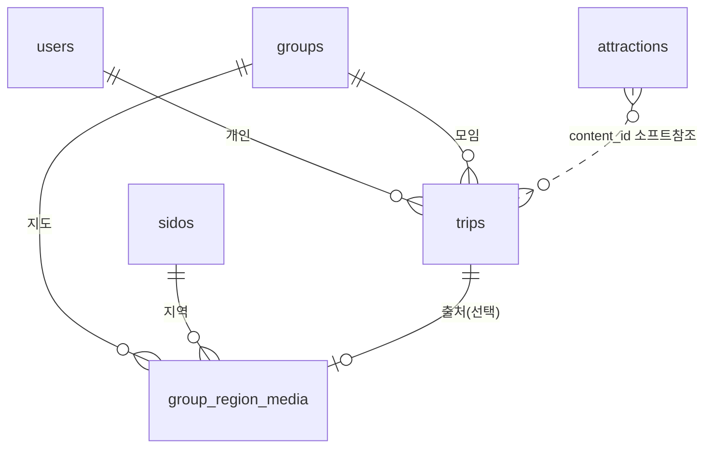

# 여행 기록 도메인 — 시나리오로 정리 (trips.data · group_region_media)

**범위**: 여행 문서(`trips.data` JSONB) + 그룹 지도(`group_region_media`)
**핵심**: "하나의 원본 → 여러 뷰" + "계획 → 기록" 전환 + "지도 지역당 대표 추억 1개"
**작성일**: 2026-06-10

---

## 1. 도메인 한눈에



| 위치 | 무엇 | 형태 |
|------|------|------|
| `trips.data` (JSONB) | **여행의 모든 항목·미디어** (그 여행 안에서) | 문서 |
| `group_region_media` (테이블) | **그룹 지도: 지역당 대표 추억 1개** | 관계형 |
| `attractions` (테이블) | 명소·카페·식당 위치 (마스터) | 정규화 |

**원칙**: 자기 여행 안에서 끝나는 데이터(항목·미디어)는 **문서(JSONB)**, 다른 엔티티와 관계·제약 있는 것(지도 대표)은 **테이블**.

---

## 2. 시나리오 — "친구들과 부산 여행"

### 🎬 STEP 1. 모임 + 여행 생성
```
groups     : {group_id:5, group_name:"부산크루"}
user_group : (user1, g5), (user2, g5)
trips      : {trip_id:10, title:"부산 2박3일",
              start:2026-07-01, end:2026-07-03, group_id:5, user_id:null,
              data: { "items": [] }}
```

### 🎬 STEP 2. 항목 추가 (data JSONB에 누적, 노션식)
```jsonc
trips(10).data = { "items": [
  { "content_id":126508, "title":"해운대", "type":"관광",
    "lat":35.158,"lng":129.16, "visitDate":"2026-07-01","order":1,
    "media":[], "properties":{"memo":"일출"} },
  { "content_id":null, "title":"돼지국밥 본가", "type":"식당",   // TourAPI에 없는 맛집
    "lat":35.15,"lng":129.05, "visitDate":"2026-07-01","order":2,
    "media":[], "properties":{"budget":9000,"rating":5} },
  { "content_id":null, "title":"KTX", "type":"이동",            // 장소 아닌 항목
    "visitDate":"2026-07-03","time":"15:00",
    "properties":{"예약번호":"..."} }
]}
```
- 관광지·맛집·이동·메모 전부 **한 문서**에. content_id는 관광지일 때만.

### 🎬 STEP 3. 여행 중 — 미디어가 항목 안에 쌓임
```jsonc
// data.items[0](해운대).media 에 추가
"media": [
  { "type":"PHOTO", "url":"...a.jpg", "metadata":{"w":4032,"h":3024} },
  { "type":"VIDEO", "url":"...b.mp4", "metadata":{"durationSec":15} }
]
```
→ 모든 추억이 **trips.data** 안에 (여행 기록).

### 🎬 STEP 4. 지도에 "대표 1개" 큐레이션
> 해운대(부산 해운대구)의 사진 중 하나를 **그룹 지도 대표**로.

```
group_region_media :
 { id:1, group_id:5, trip_id:10,
   sido_code:26, gugun_code:1,          -- 부산 해운대구
   media_type:PHOTO, media_url:"...a.jpg" }   -- data에서 골라 url 복사
-- UNIQUE(group 5, 부산, 해운대) → 그 지역엔 이 하나만
```

### 🎬 STEP 5. 계획 → 기록 전환 (자동)
| 시점 | 상태 |
|------|------|
| 7/1 이전 | **계획**: data.items만 (media 빈 배열) |
| 7/1~7/3 | **진행**: data.items[].media 쌓임 |
| **7/4 이후** | **기록**: end_date<오늘 → 그룹 지도에 노출 |

---

## 3. 같은 원본 → 여러 뷰

### ① 일정 뷰 / 갤러리 뷰 (여행 안)
```sql
SELECT data FROM trips WHERE trip_id = 10;
-- 앱이 data.items를 visitDate로 정렬(일정), media만 추리면(갤러리)
```

### ② 그룹 지도 — 지역 + 대표 추억
```sql
SELECT sido_code, gugun_code, media_type, media_url, geom
FROM group_region_media
WHERE group_id = 5;
-- 지역별 1개 → 프론트가 지역 색칠 + 대표 핀
```

### ③ (선택) content_id로 여행 검색 — GIN 활용
```sql
SELECT trip_id, title FROM trips
WHERE data @> '{"items":[{"content_id":126508}]}';   -- 해운대 간 여행
```

---

## 4. 엣지 케이스

| 상황 | 동작 | 결과 |
|------|------|------|
| 출처 여행 삭제 | group_region_media.trip_id **SET NULL** | 지도 대표 추억 **보존** |
| 관광지(해운대) TourAPI에서 삭제 | 소프트 active(배치) | data의 소프트 참조라 일정 안 깨짐 |
| 여행 삭제 | data 통째 삭제 | 그 여행 항목·미디어 정리 |
| 개인↔모임 XOR 위반 | trips CHECK | 차단 |
| 같은 지역 두 번 방문 | UNIQUE(group, 지역) | 지도 대표는 1개 유지(교체) |

---

## 5. 설계 속성 요약
- **항목·미디어 = `trips.data` JSONB** (자기 여행 안 → 문서, 동시편집은 Redis가 받고 batch flush)
- **그룹 지도 = `group_region_media`** (지역당 1개, group·trip FK)
- **attractions = 정규화 마스터** (검색·자동생성), trips.data가 content_id 소프트 참조
- **계획↔기록** = end_date + 쌓이는 media (별도 테이블 없음)
- **JSONB 원칙**: 자기 안에서 끝나는 중첩 데이터에만, 관계·제약 있으면 테이블
