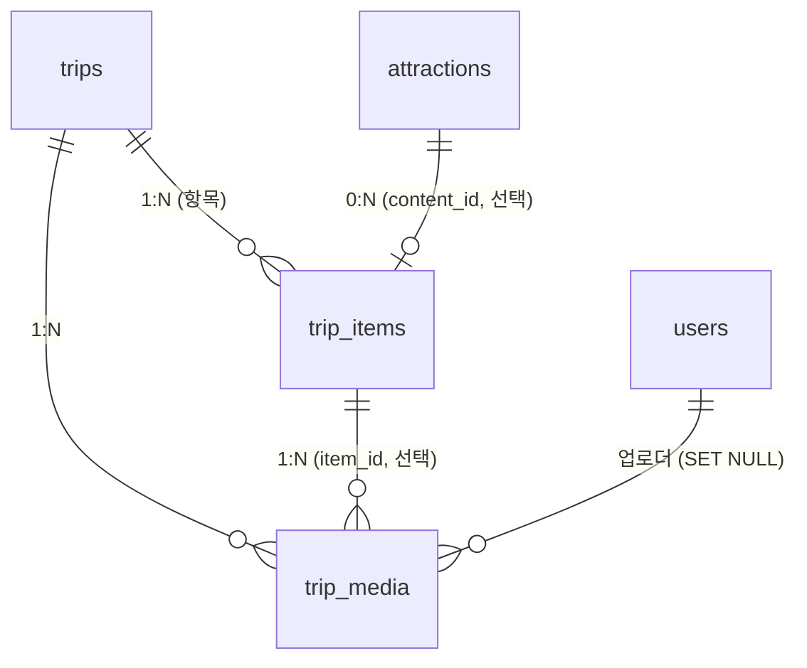

# 여행 기록 도메인 — 시나리오로 정리 (trip_items · trip_media)

**범위**: 여행 항목(trip_items) + 멀티미디어(trip_media) = "하나의 원본, 여러 뷰" + "계획 → 기록" 전환
**기준**: `schema.sql` (PostgreSQL)
**작성일**: 2026-06-10

---

## 1. 도메인 한눈에



| 테이블 | 역할 | 핵심 컬럼 |
|--------|------|-----------|
| `trips` | 여행(계획이자 기록) | end_date(전환 기준), user_id/group_id(XOR) |
| `trip_items` | **유연 항목** (관광지/맛집/이동/메모) | content_id(선택), title, item_type, geom, **properties JSONB** |
| `trip_media` | **사진·음성·영상** | trip_id, item_id(선택), user_id, media_type, geom, **metadata JSONB** |

**설계 2원칙**
1. **항목은 자유** — content_id(관광지 링크)는 선택. 없으면 title/좌표 직접 입력.
2. **미디어는 1:N으로 붙음** — 항목에(item_id) 또는 여행 전체에(item_id=NULL).

---

## 2. 시나리오 — "친구들과 부산 여행" 전체 흐름

### 🎬 STEP 1. 모임 + 여행 생성 (계획 시작)

> 나(user 1)가 친구(user 2)와 모임을 만들고 부산 여행을 계획.

```
groups       : {group_id:5, group_name:"부산크루"}
user_group   : (user 1, group 5), (user 2, group 5)
trips        : {trip_id:10, title:"부산 2박3일",
                start_date:2026-07-01, end_date:2026-07-03,
                group_id:5, user_id:NULL}   ← 모임 여행 (XOR)
```

### 🎬 STEP 2. 항목 추가 (노션식 자유 항목)

> 관광지·맛집·이동을 섞어서 담음. 자유 필드(예산/메모)는 properties로.

```
trip_items
 ┌ item 1: 해운대            content_id=126508,  type=관광, geom=O,  visit_date=07-01
 │         properties: {"budget":0, "memo":"일출"}
 ├ item 2: 돼지국밥 본가      content_id=NULL, title="돼지국밥 본가", ← TourAPI에 없는 맛집
 │         type=식당, geom=직접입력, visit_date=07-01
 │         properties: {"budget":9000, "rating":5, "tags":["로컬맛집"]}
 └ item 3: KTX 부산→서울      content_id=NULL, title="KTX", type=이동,
           visit_date=07-03, visit_time=15:00
           properties: {"예약번호":"...", "비용":59800}
```
- item 1 = 관광지 링크(content_id) → 위치·이미지는 attractions에서 JOIN
- item 2 = **자유 항목** (관광지 아님) → title·좌표 직접
- item 3 = **장소 아닌 항목**(이동) → properties에 예약정보
- ✅ CHECK 통과: content_id 있거나(item1) title 있음(item2,3)

### 🎬 STEP 3. 여행 중 — 미디어 업로드 (기록 쌓임)

> 현장에서 사진·영상을 항목에 붙임. 특정 항목 없는 단체사진은 여행 전체로.

```
trip_media
 ┌ media A: 사진  trip_id=10, item_id=1[해운대],     user_id=1[나]
 │          metadata:{"width":4032,"height":3024,"thumbnailUrl":"..."}
 ├ media B: 영상  trip_id=10, item_id=2[국밥집],     user_id=2[친구]
 │          metadata:{"durationSec":15,"codec":"h264"}
 └ media C: 사진  trip_id=10, item_id=NULL[여행전체], user_id=1[나]  ← 단체샷
            geom=촬영좌표, metadata:{...}
```

### 🎬 STEP 4. 여행 후 — 계획이 기록으로 전환 (자동)

> `end_date(07-03) < 오늘` 이 되는 순간, 별도 작업 없이 "기록"으로.

| 시점 | 같은 trip_id=10 데이터가… |
|------|--------------------------|
| 7/1 이전 | **계획**: trip_items만 (미디어 없음) |
| 7/1~7/3 | **진행**: trip_items + trip_media 쌓임 |
| **7/4 이후** | **기록**: 그룹 발자취 지도에 노출 (end_date < 오늘) |

→ 전환 트리거 = `end_date` 하나. 기록용 별도 테이블 없음.

---

## 3. 같은 원본 → 3가지 뷰

### ① 일정 뷰 (타임라인)
```sql
SELECT item_id, title, item_type, visit_date, visit_time, properties
FROM trip_items
WHERE trip_id = 10
ORDER BY visit_date, visit_order;
```

### ② 지도 뷰 (위치 + 미디어 마커)
```sql
SELECT i.title,
       COALESCE(i.geom, a.geom) AS location,   -- 자체좌표 or 관광지좌표
       m.media_url, m.media_type
FROM trip_items i
LEFT JOIN attractions a ON a.content_id = i.content_id
LEFT JOIN trip_media   m ON m.item_id   = i.item_id
WHERE i.trip_id = 10;
```

### ③ 갤러리 뷰 (미디어만)
```sql
SELECT media_url, media_type, metadata, created_at
FROM trip_media
WHERE trip_id = 10
ORDER BY created_at;
```

### ④ 그룹 발자취 지도 (시그니처 — 다녀온 여행 전체 미디어)
```sql
SELECT m.media_url, m.media_type,
       COALESCE(m.geom, i.geom) AS pin,
       m.metadata
FROM trip_media m
JOIN trips t       ON t.trip_id = m.trip_id
LEFT JOIN trip_items i ON i.item_id = m.item_id
WHERE t.group_id = 5
  AND t.end_date < CURRENT_DATE;     -- 다녀온 여행만
```
+ 권역 색칠은 `trip_region_snapshots` 집계 (별도).

---

## 4. 엣지 케이스 (데이터가 안 깨지는 이유)

| 상황 | 동작 | 결과 |
|------|------|------|
| **친구(업로더) 탈퇴** | trip_media.user_id `SET NULL` | 미디어 B(영상)는 **보존**, 업로더만 비움 |
| **TourAPI에서 해운대 삭제** | 배치는 하드삭제 X (소프트 `active=false` 권장) | item 1의 content_id 링크 유지, 일정 안 깨짐 |
| **항목(국밥집) 삭제** | trip_media.item_id `SET NULL` | 미디어 B는 trip_id로 **여행엔 여전히 소속** |
| **여행 삭제** | trip_items·trip_media `CASCADE` | 여행 통째로 정리 (개인 여행 기준) |
| **개인→모임 XOR 위반** | trips CHECK | 생성 자체 차단 |

---

## 5. 설계 속성 요약

- **유연성**: trip_items가 관광지·맛집·이동·메모 모두 담음 (content_id 선택, properties 자유).
- **1 원본 N 뷰**: 같은 trip_items/trip_media를 일정·지도·갤러리로 렌더.
- **계획↔기록**: 별도 테이블 없이 `end_date` + 쌓이는 `trip_media`로 자연 전환.
- **추억 보존**: 업로더 탈퇴·항목 삭제에도 미디어 살아남음 (SET NULL).
- **빠른 집계**: 미디어가 별도 테이블이라 그룹 발자취를 가로질러 한 방에 조회 (GIST/GIN).
- **JSONB 2곳**: `trip_items.properties`(자유 필드), `trip_media.metadata`(미디어 메타).
